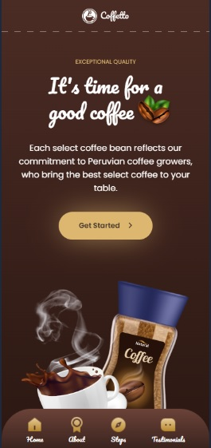

# _Coffetto_ - Responsive web site

## Description.

Responsive web project made for a _**Coffetto**_ brand.
In it we have the presentation of the brand, the different products and a bit of its history.  

The project _**Coffetto**_ is designed with the concept of web design _Mobile First_, adapted from the smallest mobile phones, through tablets, laptops and reaching the largest resolutions.

## Images.

### Mobile image.

### Tablet image.

### Desktop image.

## Technologies

In this project we used the two most basic web development languages (_HTML_ & _CSS_) for the structure and design respectively and its architecture was built using the _BEM_ methodology.

## Link

https://zalliopablo.github.io/coffetto-website/

